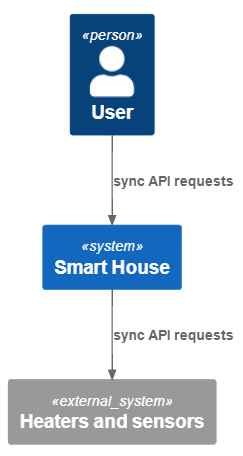
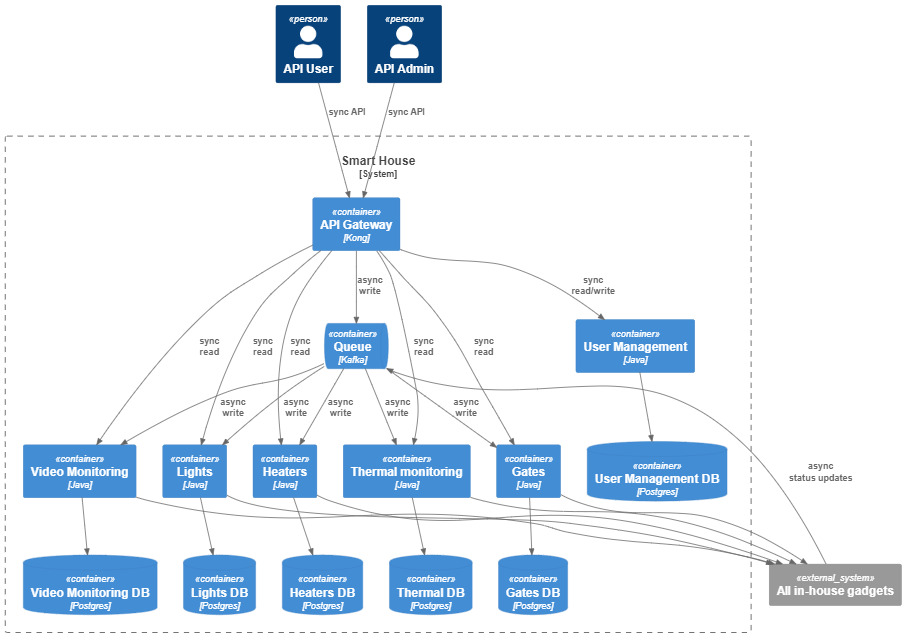
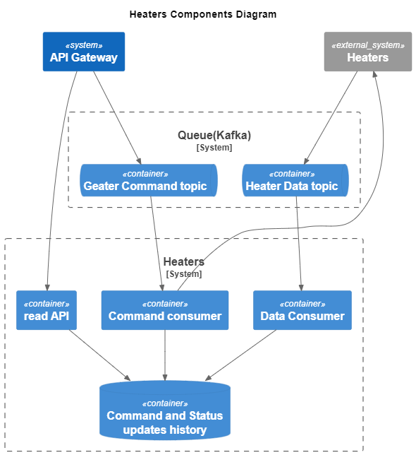
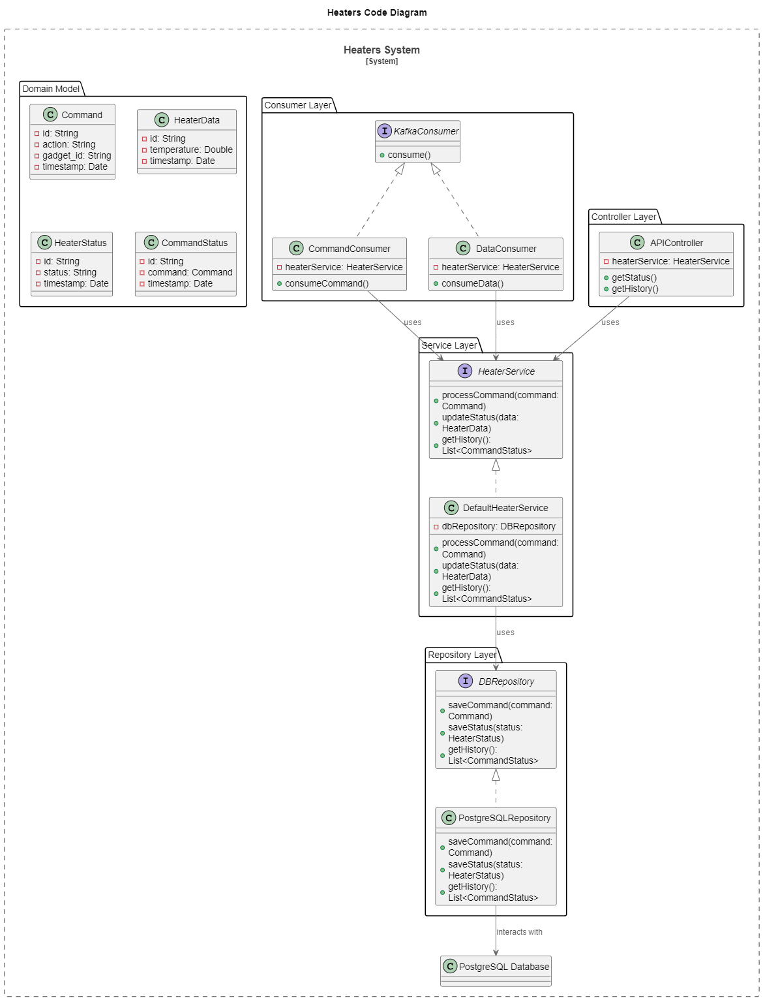
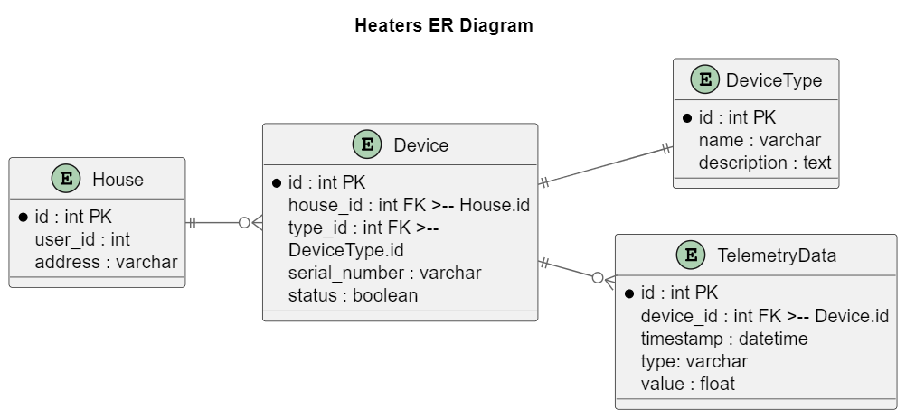

# Задание 1. Анализ и планирование

### 1. Описание функциональности монолитного приложения

**Управление отоплением:**

- Пользователи могут удалённо включать/выключать отопление в своих домах.
- Система поддерживает: 
    - включение/выключение нагревателя
    - установку желаемой температуры

**Мониторинг температуры:**

- Система получает данные о температуре с датчиков, установленных в домах. 
- Пользователи могут просматривать текущую температуру в своих домах через веб-интерфейс.

### 2. Анализ архитектуры монолитного приложения

Архитектура приложения представляет из себя монолит на Java с СУБД Postgres. Всё синхронно. Никаких асинхронных вызовов, микросервисов и реактивного взаимодействия в системе нет. Всё управление идёт от сервера к датчику. Данные о температуре также получаются через запрос от сервера к датчику на нагревателе, температурные сенсоры не доступны через API.

### 3. Определение доменов и границы контекстов

Домены существующей системы:
- Нагревательные приборы.
- Датчики температуры.

Контексты:
- Система "Умный Дом"
- Дома с установленными датчиками.
- Пользователи системы.

### **4. Проблемы монолитного решения**

- Из за синхронной работы интерфейсов масштабирование системы будет затруднено.
- Поддерживаются только нагреватели.
- Датчики температуры недоступны пользователю через API.
- Ни какие другие датчики или системы не поддерживаются.
- Самостоятельно подключить свой датчик к системе пользователь не может.

### 5. Визуализация контекста системы — диаграмма С4

# Задание 2. Проектирование микросервисной архитектуры

**Диаграмма контейнеров (Containers)**

**Диаграмма компонентов (Components)**

**Диаграмма кода (Code)**

# Задание 3. Разработка ER-диаграммы

